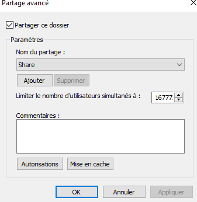

# powershell_adds
faite une ligne de commande pour chaque UO que vous voulez crée afin qu'ils soient enregistré automatiquement

une fois le script powershell lancé correctement vous optiendrez ces UO dans votre active directory

une fois cela fait vous pouvez ajouter des utilisateurs à cette UO 

à la suite de cette action créé un groupe pour qu'il y est une sorte d'organisition dans votre active directory 

et ajouté les utilisateurs à l'intérieur

Pour finir il faut créé un dossier partagé

